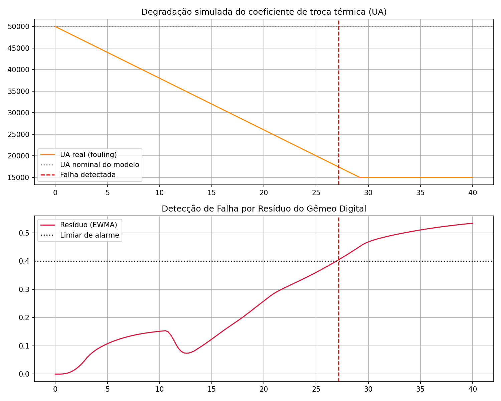
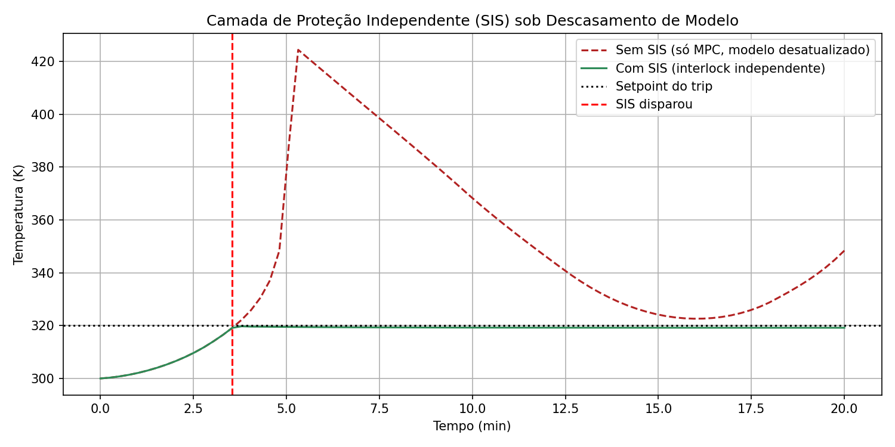
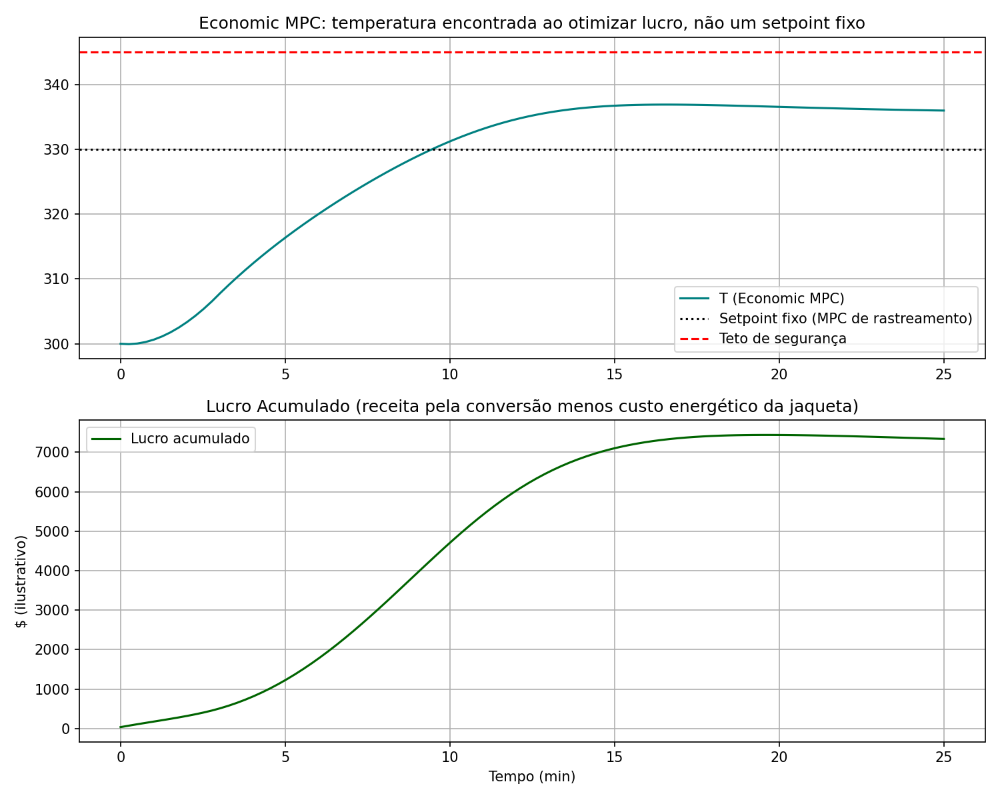
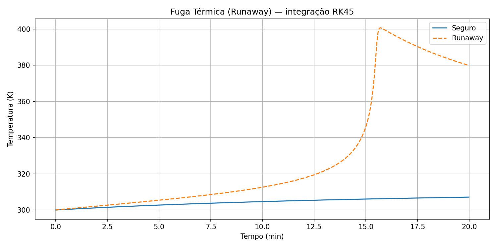
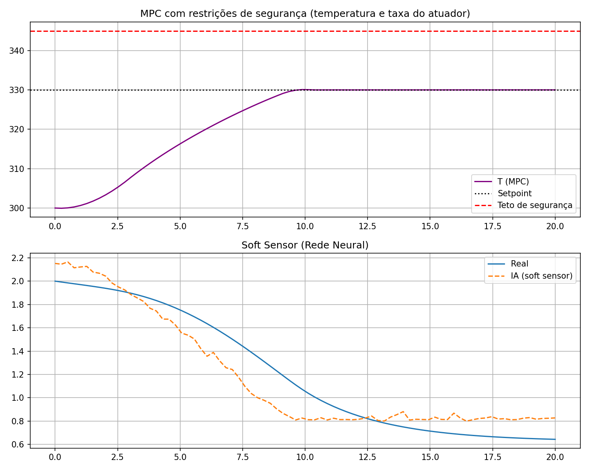

# 🏭 Gêmeo Digital Dinâmico e Controle Avançado de um Reator CSTR Não-Isotérmico

Este repositório contém o ecossistema completo de um **Gêmeo Digital (Digital Twin)** para um reator químico de mistura contínua (CSTR) operando sob reação exotérmica não-linear. O projeto aborda a modelagem rigorosa dos balanços de massa e energia, simulação de falhas operacionais (*thermal runaway*), controle preditivo multivariável (MPC) de rastreamento **e econômico (Economic MPC)** com restrições de segurança, sensores virtuais (*soft sensors*) baseados em Aprendizado Profundo, detecção de falhas por resíduo (*fault detection*), uma camada de proteção independente (SIS) inspirada em práticas reais de segurança de processo (HAZOP/LOPA, IEC 61511) e uma camada de integração via **OPC-UA** (o protocolo padrão para conectar a um DCS/historiador real) — aplicável a plantas de polimerização, química fina, farmacêutica e petroquímica.

📄 **[Projeto Industrial Completo](docs/PROJETO_INDUSTRIAL.md)** — arquitetura, roadmap de implantação (simulação → shadow mode → piloto → produção), requisitos técnicos e caso de negócio para levar isto a uma planta real.

---

## 📐 Modelagem Matemática do Processo

A dinâmica do reator é regida por um sistema de equações diferenciais ordinárias acopladas:

### 1. Balanço de Massa do Componente $A$
$$\frac{dC_A}{dt} = \frac{F}{V}(C_{A0} - C_A) - k(T)C_A$$

### 2. Balanço de Energia Térmica
$$\frac{dT}{dt} = \frac{F}{V}(T_0 - T) + \frac{(-\Delta H_{rx}) \cdot k(T)C_A}{\rho C_p} + \frac{UA(T_j - T)}{V \rho C_p}$$

### 3. Cinética Reacional (Lei de Arrhenius)
$$k(T) = A \cdot e^{-\frac{E_a}{R \cdot T}}$$

### 4. Integração Numérica

As equações são integradas com métodos adequados a cada uso: **RK45 adaptativo** (`scipy.integrate.solve_ivp`) na análise de fuga térmica em malha aberta, onde a dinâmica se torna rígida (*stiff*) perto do runaway; e **RK4 de passo fixo** dentro do MPC, que equilibra precisão e custo computacional determinístico exigido por um controlador em tempo real.

---

## 🛡️ Segurança e Confiabilidade

### MPC com Restrições de Segurança
Além de perseguir o setpoint, o controlador preditivo respeita duas restrições explícitas, impostas ao otimizador via `NonlinearConstraint`:
- **Teto de temperatura** (`T_max_seguro`): a trajetória prevista ao longo do horizonte não pode ultrapassar o limite térmico seguro do reator.
- **Limite de taxa do atuador** (`taxa_max_Tj`): a temperatura da jaqueta não pode variar além de um valor máximo por passo de controle, refletindo a dinâmica real do atuador.

### Detecção de Falha por Resíduo (Fouling do UA)
O gêmeo digital também monitora a saúde do processo: um cenário dedicado simula a incrustação progressiva (*fouling*) da superfície de troca térmica, reduzindo gradualmente o coeficiente `UA` real da planta enquanto o modelo do MPC continua assumindo o valor nominal. Um detector por resíduo (média móvel exponencial do erro entre a temperatura medida e a prevista pelo modelo) sinaliza a degradação **antes** que ela se torne um evento de segurança — mesmo quando o MPC ainda consegue manter a temperatura no setpoint, mascarando o sintoma.



### Camada de Proteção Independente (SIS)
Restrições dentro do MPC só são tão boas quanto o modelo em que se baseiam. Para representar esse risco, simulamos um descasamento de modelo: o MPC otimiza assumindo a cinética nominal, mas a planta real segue uma cinética mais severa (uma impureza ou reação secundária não prevista — a causa raiz clássica dos incidentes reais citados abaixo). Sem proteção adicional, o reator dispara para ~424 K antes de a reação se autolimitar. Um **SIS (Sistema Instrumentado de Segurança)** — um trip *hard-wired*, independente do modelo do MPC, que força resfriamento máximo ao cruzar um limite de temperatura — contém o mesmo cenário em ~320 K, seguindo o princípio de *layers of protection* da norma IEC 61511:



---

## 💰 Economic MPC

O MPC de rastreamento persegue um setpoint fixo ($330\text{ K}$) escolhido *a priori* por um engenheiro. Mas esse setpoint é só uma aproximação do que realmente importa para a planta: o resultado econômico. O **Economic MPC** (`rodar_mpc_economico`) substitui o custo de rastreamento por um custo econômico direto a cada passo do horizonte — receita pela conversão de $A$ menos custo energético da carga térmica da jaqueta — mantendo as mesmas restrições de segurança (teto de temperatura e taxa do atuador) do MPC de rastreamento:

$$\text{custo} = \text{custo\_energia} \cdot |UA(T_j - T)| \cdot \Delta t - \text{preço\_produto} \cdot \Delta n_A$$

Com os parâmetros ilustrativos deste projeto, o Economic MPC descobre sozinho que vale a pena operar a ~336-337 K — *acima* do setpoint fixo de 330 K, mas com margem segura abaixo do teto de segurança — porque a receita extra da conversão mais rápida supera o custo energético adicional. Trocar os preços (`preco_produto`, `custo_energia`) desloca esse ponto ótimo, sem precisar reajustar setpoint nenhum manualmente:



---

## 📊 Resultados da Simulação

### 1. Análise de Fuga Térmica (*Thermal Runaway*)
Avaliação de risco em malha aberta demonstrando como uma queda de eficiência no coeficiente de troca térmica ($UA$) provoca a disparada de temperatura no reator. Essa análise usa um calor de reação de **pior caso** ($\Delta H_{rx}$ conservador, ao estilo HAZOP), deliberadamente mais severo que a cinética nominal usada nas simulações de controle abaixo — a mesma lógica de uma análise de segurança de processo, que avalia o cenário crível mais adverso em vez da operação normal:



### 2. Controle Preditivo (MPC) e Soft Sensor com Incerteza (Ensemble)
Desempenho da malha fechada mantendo o reator no setpoint estipulado ($330\text{ K}$) enquanto um ensemble de 15 Redes Neurais (MLP, treinadas por bootstrap) estima a concentração de saída $C_A$ em tempo real. A dispersão entre as redes do ensemble fornece uma banda de incerteza (±2 desvios-padrão) — sinalizando quando a estimativa é menos confiável, em vez de só um valor pontual:



---

## 🏗️ Arquitetura e Integração com Planta Real

O código foi reorganizado em um pacote configurável, `reator_digital_twin/`, para que o mesmo gêmeo digital sirva plantas reais diferentes só trocando um arquivo de configuração — sem tocar em modelagem, controle ou segurança:

- **`reator_digital_twin/config.py`** — todos os parâmetros de planta (cinética, atuador, economia) vêm de uma `ConfiguracaoReator`, carregável de YAML: `configs/reator_padrao.yaml` (usado pelas demos), `configs/exemplo_planta_industrial.yaml` (química fina, escala industrial) e `configs/exemplo_biodiesel.yaml` (transesterificação alcalina) — três aplicações bem diferentes provando a reutilização do mesmo código.
- **`reator_digital_twin/modelo.py`** — a física, o MPC e o SIS, incluindo `calcular_acao_controle()`: resolve um único passo do MPC a partir do estado medido, a interface que a integração em tempo real usa (em vez de rodar uma simulação de ponta a ponta).
- **`reator_digital_twin/integracao/`** — um servidor e um cliente **OPC-UA** reais (biblioteca `asyncua`), demonstrando a arquitetura de conexão com uma planta real: o servidor representa o DCS/historiador (publica `PV_Temperatura`, `PV_ConcentracaoA` e expõe o método `AvancarPasso`); o gateway é um processo separado que lê o estado, resolve o MPC e aciona a planta — o mesmo padrão usado por soluções comerciais de APC (Aspen DMC3, Honeywell Profit Controller) para se conectar a um DCS.

Rode a demonstração de integração (servidor e cliente como processos de verdade, comunicando só por rede):
```bash
python demo_integracao_opcua.py
```

Ver **[docs/PROJETO_INDUSTRIAL.md](docs/PROJETO_INDUSTRIAL.md)** para o roadmap completo de como isso evolui de simulação para uma implantação real — incluindo por que o SIS deste repositório é conceitual, não um sistema certificado (IEC 61508/61511), e o que precisa ser validado antes de conectar a uma planta de verdade.

---

## 🏭 Aplicações Industriais

Um CSTR não-isotérmico com risco de fuga térmica não é um exercício acadêmico isolado — é o núcleo de processos usados hoje em vários segmentos da indústria química e de processos:

- **Polimerização** (polímeros, borrachas sintéticas, tintas e revestimentos): reações fortemente exotérmicas em que perda de resfriamento é um dos cenários de risco mais estudados em engenharia de segurança de processo.
- **Química fina e especialidades** (nitração, oxidação, hidrogenação, esterificação): usadas em agroquímicos, intermediários farmacêuticos e aditivos industriais — tipicamente avaliadas via HAZOP/LOPA justamente por causa do potencial de *runaway*.
- **Farmacêutica** (manufatura contínua de API): substituição gradual de processos em batelada por reatores contínuos com controle avançado, reduzindo a dependência de analisadores em linha caros através de soft sensors.
- **Refino e petroquímica de base**: controle preditivo multivariável (APC/MPC) já é padrão de mercado em unidades de reação, com restrições de segurança embutidas no otimizador.
- **Tratamento de efluentes e utilidades industriais**: qualquer planta com trocadores de calor em serviço contínuo enfrenta o mesmo problema de degradação gradual (*fouling*) abordado pelo módulo de detecção de falha deste projeto.
- **Biodiesel** (transesterificação alcalina): reação bem mais branda termicamente — o encaixe aqui é outro, o Economic MPC (margens apertadas, trade-off excesso de metanol vs. conversão) e o soft sensor (medir conversão em FAME normalmente exige GC/titulação) importam mais que a análise de fuga térmica. Ver `configs/exemplo_biodiesel.yaml`.

### Incidentes reais que motivam este projeto

Os módulos de segurança deste repositório (restrições de temperatura no MPC, detecção de falha por resíduo e a camada de proteção independente) não são adicionados por acaso — eles espelham causas-raiz documentadas em investigações reais de acidentes industriais:

- **T2 Laboratories (Jacksonville, EUA, 2007)** — uma reação de fuga térmica durante a produção de MCMT, agravada pela perda de resfriamento adequado, resultou em explosão equivalente a ~635 kg de TNT, matando 4 pessoas. A investigação do [U.S. Chemical Safety Board](https://www.csb.gov/file.aspx?DocumentId=5619) apontou falta de uma análise de perigos de processo (PHA) que identificasse a necessidade de sistemas de segurança críticos, como resfriamento redundante — exatamente o papel que o SIS deste projeto ilustra.
- **Synthron Inc. (Morganton, EUA, 2006)** — um *scale-up* incorreto da receita (carregando todo o monômero de uma vez) mais do que dobrou a taxa de liberação de energia no reator, excedendo a capacidade do condensador e causando reação de fuga e explosão de nuvem de vapor. Esse é o cenário que a análise de risco em malha aberta deste projeto (calor de reação de pior caso) busca representar.

Esses dois casos ilustram o mesmo padrão: o sistema de controle em operação normal (BPCS) não é, por si só, suficiente — faltou uma camada de proteção independente e dimensionada para o pior caso crível, não para a condição nominal.

### Tendências que moldam a próxima evolução deste projeto

- O mercado de gêmeos digitais para a indústria de processos químicos foi avaliado em ~US$ 4 bilhões em 2026, com crescimento projetado de ~24% ao ano até 2035, puxado por modelos híbridos que combinam simulação física com IA e pela integração com dados de planta em tempo real ([Dimension Market Research](https://dimensionmarketresearch.com/report/chemical-process-digital-twin-market/); [Kongsberg Digital](https://kongsbergdigital.com/blog/12-game-changing-ways-digital-twins-can-boost-the-chemical-industry)).
- Soft sensors baseados em aprendizado de máquina já são aplicados em refino, química fina, farmacêutica, polimerização e tratamento de efluentes como alternativa de baixo custo a analisadores em linha ([Transfer Learning for Soft Sensors in Process Industries, I&EC Research](https://pubs.acs.org/doi/10.1021/acs.iecr.5c05144)).
- A literatura acadêmica recente (2024-2025) tem se concentrado exatamente na combinação que este projeto implementa: MPC com restrições de segurança derivadas de HAZOP ([Chemical Engineering Transactions](https://www.cetjournal.it/index.php/cet/article/view/CET2399107)) e controle tolerante a falhas para CSTRs exotérmicos ([Model-Based Fault Diagnosis and Fault Tolerant Control for Safety-Critical Chemical Reactors, I&EC Research](https://pubs.acs.org/doi/10.1021/acs.iecr.3c01205)).

---

## ⚙️ Como Executar o Projeto

1. Clone o repositório:
   ```bash
   git clone https://github.com/danielschmitt-ia/chemical-engineering.git
   cd chemical-engineering
   ```

2. Instale as dependências:
   ```bash
   pip install -r requirements.txt
   ```
   Se o `asyncua` falhar por conflito com o pacote `cryptography` do sistema (comum em algumas distros Linux), rode antes: `pip install --upgrade --ignore-installed cryptography`.

3. Execute a simulação integrada:
   ```bash
   python main.py
   ```

   O script imprime no console o instante em que uma eventual falha de fouling é detectada, o instante em que o SIS dispara e o lucro acumulado do Economic MPC, e exibe/salva 5 figuras: fuga térmica (`estabilidade_runaway.png`), MPC com restrições de segurança e soft sensor (`mpc_softsensor.png`), degradação do `UA` e resíduo de detecção de falha (`deteccao_falha.png`), comparação com/sem camada de proteção independente (`interlock_seguranca.png`) e o Economic MPC (`economic_mpc.png`).

4. (Opcional) Rode a demonstração de integração via OPC-UA (servidor e cliente reais, processos separados):
   ```bash
   python demo_integracao_opcua.py
   ```
   Salva `integracao_opcua.png`, mostrando o MPC operando o reator através de leituras e escritas de rede reais, não chamadas de função em processo.

---

## 🧪 Testes

O pacote `reator_digital_twin/` tem uma suíte de testes automatizados (`pytest`), incluindo testes de integração que sobem um servidor OPC-UA de verdade — não mocks. Vários deles são regressões diretas de bugs reais encontrados construindo a integração (descasamento de relógio planta/controlador, falta de *warm-start* no otimizador, SIS disparando fora de hora — ver histórico de commits).

```bash
pip install -r requirements-dev.txt
pytest -v
```

A suíte cobre carregamento de config (incluindo a pegadinha de notação científica do PyYAML), o modelo físico, os dois MPCs, a detecção de falha, o SIS e o ciclo fechado via OPC-UA. Leva ~2 minutos (a maior parte é tempo real de otimização SLSQP, não overhead de teste) — ainda não está conectada a um pipeline de CI (ver `docs/PROJETO_INDUSTRIAL.md`, seção 8).
